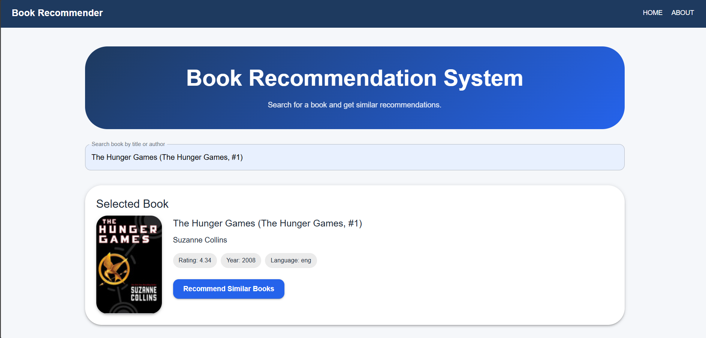
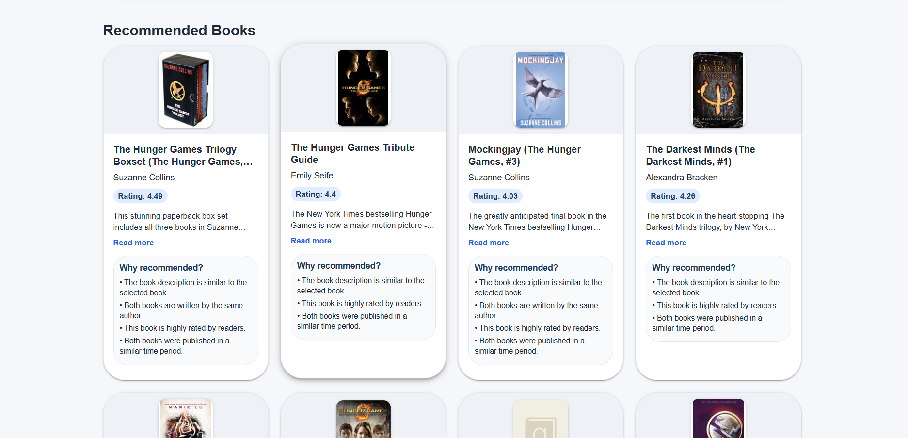
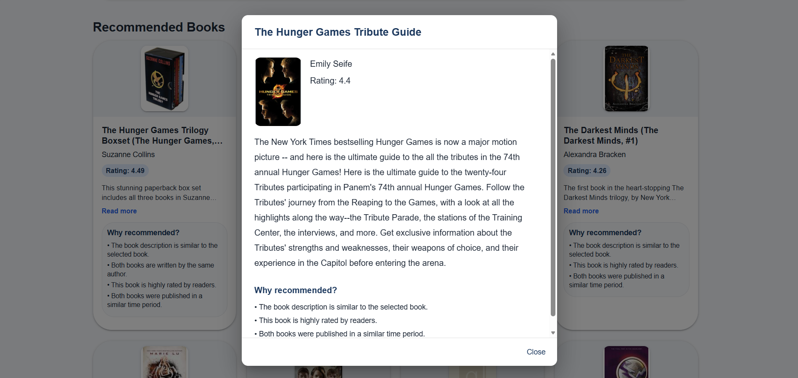

# Book Recommendation System

A web application where a user searches for a book, picks one, and gets a list of
similar books back  along with a reason for why that book was
recommended.
It is built as three separate services (React frontend, FastAPI
backend, MySQL database) that run in their own Docker containers and talk to each
other over a custom Docker network.

---

## Table of Contents

- [Why I Chose This Project](#why-i-chose-this-project)
- [What Makes It Different](#what-makes-it-different)
- [Features](#features)
- [Tech Stack](#tech-stack)
- [Architecture](#architecture)
- [Dataset](#dataset)
  - [Data preparation](#data-preparation)
- [Recommendation Algorithm](#recommendation-algorithm)
  - [Key settings](#key-settings-appconstantssettingspy)
- [API Endpoints](#api-endpoints)
- [Installation Guide](#installation-guide)
- [User Manual](#user-manual)
- [Local Development (without Docker)](#local-development-without-docker)
- [Environment Variables](#environment-variables)
- [Folder Structure](#folder-structure)
- [Backend Startup Flow](#backend-startup-flow)
- [Screenshots](#screenshots)
- [Limitations](#limitations)
- [Future Improvements](#future-improvements)
- [A Note on AI Usage](#a-note-on-ai-usage)

## Why I Chose This Project

I chose a book recommender because people often spend too much time trying to find
the right book to read. They want to read a book that is similar to the one they just
read, so I built a book recommender that recommends books based on a selected book.
It uses TF-IDF and cosine similarity to find similar books, and the user gets 10
recommendations to choose from.

## What Makes It Different

This app not only recommends similar books but also gives reasons as to why each book
was recommended. That is the special feature of the app.

For every recommendation it returns a short list of human-readable reasons, for
example:

- The book description is similar to the selected book.
- Both books are written by the same author.
- This book is highly rated by readers.
- Both books were published in a similar time period.


---

## Features

- Search books by title or author.
- Select a book and get up to 10 similar books.
- A plain-language "Why recommended?" explanation on every result.
- "Read more" dialog with the full description and reasons.
- Health-check endpoint for the backend.
- Fully containerized one command to run everything.

---

## Tech Stack

**Frontend:** React, Vite, Material UI, React Router, Axios

**Backend:** Python, FastAPI, SQLAlchemy, PyMySQL, pandas, scikit-learn, python-dotenv, cryptography

**Database:** MySQL 8.0.38

**Infrastructure:** Docker, Docker Compose, custom bridge network

---

## Architecture


---

## Dataset

**Source:** Kaggle *Books Dataset for NLP & Recommendation Systems*

**Link:** https://www.kaggle.com/datasets/sinatavakoli/books-dataset-for-nlp-and-recommendation-systems

**File:** `Backend/data/book.csv`

**Size:** 4,766 books

**Columns used:** `book_id`, `title`, `authors`, `description`,
`original_publication_year`, `language_code`, `average_rating`, `image_url`
**Dropped:** `Unnamed: 0` (index artifact from the CSV).

### Data preparation

Done during import (`import_service.py`):

- Remove duplicate books by `book_id`.
- Fill missing `title`, `description`, `language_code`, `image_url` with an empty string.
- Fill missing `authors` with `"Unknown"`.
- Convert `average_rating` to a number, defaulting to `0.0`.
- Convert `original_publication_year` to a number, allowing `None` if missing.

---

## Recommendation Algorithm

The app uses **content-based filtering**:

1. Every book description is turned into a TF-IDF vector using scikit-learn's
   `TfidfVectorizer` (capped at 5,000 features).
2. **Cosine similarity** is computed between all books to produce a similarity
   matrix.
3. For a selected book, the most similar books are ranked, filtered by a minimum
   similarity threshold, and the top 10 are returned.

The TF-IDF model and similarity matrix are built **once at startup** and kept in
memory. Because the dataset is small (4,766 books), this is fast and avoids
recalculating similarity on every request.


### Key settings (`app/constants/settings.py`)

| Setting | Value | Reason |
|---|---|---|
| `TOP_RECOMMENDATIONS` | 10 | Number of books returned per recommendation. |
| `MAX_SEARCH_RESULTS` | 10 | Cap on search results. |
| `DEFAULT_BOOK_LIST_LIMIT` | 50 | Size of the default book list. |
| `MAX_TFIDF_FEATURES` | 5000 | Keeps the TF-IDF matrix manageable. |
| `MIN_SIMILARITY_SCORE` | 0.05 | Cosine scores on long descriptions are naturally low; 0.05 keeps relevant matches without over-filtering. A higher value like 0.15 dropped too many useful results. |

---

## API Endpoints

| Method | Endpoint | Description |
|---|---|---|
| GET | `/health` | Health check. |
| GET | `/books/` | Returns a small list of books. |
| GET | `/books/search?q=harry` | Search books by title or author. |
| GET | `/recommendations/{book_id}` | Returns the selected book and its recommendations. |

Example:

```
GET /recommendations/1
```

---

## Installation Guide

**Prerequisite:** Docker Desktop installed and running.

```bash
git clone https://github.com/Rahul-Rasal/Book-Recommendation.git
cd Book-Recommendation
docker compose up --build
```

Then open:

- Frontend: http://localhost:5173
- Backend health check: http://localhost:8000/health


To stop:

```bash
docker compose down
```

To stop and also remove the database volume (fresh start):

```bash
docker compose down -v
```

---

## User Manual

1. Open the app at http://localhost:5173.
2. Type a book title or author in the search box.
3. Select a book from the suggestions that appear.
4. Click "Recommend Similar Books."
5. Browse the recommended books. Each card shows the cover, author, rating, and a "Why recommended?" explanation. Click "Read more" on any card to see the full description.

---

## Local Development (without Docker)

**Backend**

```bash
cd Backend
python -m venv .venv
# Windows:
.venv\Scripts\activate
# macOS/Linux:
source .venv/bin/activate

pip install -r requirements.txt
# Make sure a local MySQL is running and Backend/.env is filled in (see below)
uvicorn app.main:app --reload --port 8000
```

**Frontend**

```bash
cd frontend
npm install
npm run dev
```

---

## Environment Variables

### Backend (`Backend/.env` local development only, not committed)

```
DB_HOST=localhost
DB_PORT=3306
DB_NAME=books_db
DB_USER=root
DB_PASSWORD=your_mysql_password
```

A sample is provided in `Backend/.env.example`.

**In Docker you do not need `Backend/.env`** `docker-compose.yml` injects the
database settings directly.

### Frontend (`frontend/.env.example`)

```
VITE_API_BASE_URL=http://localhost:8000
```

---

## Folder Structure

```
Book_R/
├── Backend/
│   ├── app/
│   │   ├── routers/          # API endpoints (books, recommendations)
│   │   ├── services/         # import, search, recommendation, explanation logic
│   │   ├── repositories/     # database access
│   │   ├── ml/               # TF-IDF + cosine similarity model
│   │   ├── utils/            # text cleaning
│   │   ├── constants/        # settings
│   │   ├── main.py           # FastAPI app + routes + CORS
│   │   ├── startup.py        # create tables, import, build model
│   │   ├── config.py         # reads DB settings from environment
│   │   ├── database.py       # SQLAlchemy engine / session / Base
│   │   └── models.py         # Book table
│   ├── data/book.csv         # dataset
│   ├── requirements.txt
│   └── Dockerfile
├── frontend/
│   ├── src/
│   │   ├── api/bookApi.js     # Axios calls to the backend
│   │   ├── components/        # SearchBox, SelectedBook, RecommendationList/Card, Footer
│   │   └── pages/             # Home, About
│   └── Dockerfile
└── docker-compose.yml
```

---

## Backend Startup Flow

The backend runs this once on startup (via FastAPI's lifespan handler in
`main.py` → `initialize_application()` in `startup.py`):

1. Wait for the database to accept connections (retry loop).
2. SQLAlchemy creates the database tables if they don't already exist.
3. The CSV is imported if the `books` table is empty, skipped otherwise.
4. All books are loaded from MySQL into memory.
5. The TF-IDF model and cosine similarity matrix are built in memory.
6. The API is ready to serve requests.

---

## Screenshots

**Home search and selected book**



**Recommendations with "Why recommended?" explanations**



**"Read more" dialog with full book description**



---

## Limitations

- No user login or personalization.
- No genre-based recommendation the dataset has no genre column, so the app never
  claims genre similarity.
- Similarity is based mainly on description text.
- The in-memory similarity matrix works well for this dataset size but would need a
  different approach for very large datasets.

## Future Improvements

- User accounts and saved favorites.
- Rating-based personalization.
- Genres/categories if the dataset supports them.
- Pagination and better search ranking.
- For larger datasets: precomputed top-N recommendations or vector search.
- Cloud deployment.

---

## A Note on AI Usage

AI tools were used to assist during development. All design decisions were taken by
me. The tools were used for debugging, researching, and assisting with coding.
